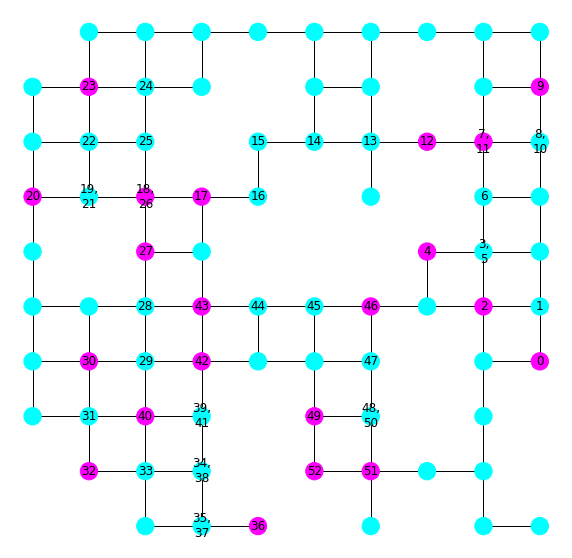

# nx-concorde

[Concorde TSP solver](http://www.math.uwaterloo.ca/tsp/concorde.html) for [networkx graphs](https://networkx.github.io/). 🛫



## Usage

```python
from nx_concorde import calc_tour

# graph: A nx.Graph() object.
# start_node: Node ID where your tour should start.
# end_node: Node ID where your tour should end.
# visit_nodes: List of node IDs that your tour should visit.

tour = calc_tour(graph, start_node, end_node, visit_nodes)
tour # List of node IDs that the optimal tour traverses.
```

## Advanced Usage

```python
from nx_concorde import calc_tour, calc_path_matrix, calc_distance_matrix

# graph: A nx.Graph() object.
# start_node: Node ID where your tour should start.
# end_node: Node ID where your tour should end.
# visit_nodes: List of node IDs that your tour should visit.
# heuristic: Callable lower bound distance estimate between nodes.

path_matrix = calc_path_matrix(graph, heuristic) # Dictionary with shortest paths.
distance_matrix = calc_distance_matrix(graph, path_matrix) # Dictionary with shortest path lengths.

# Precomputing path_matrix and distance_matrix makes `calc_tour` much faster.
tour = calc_tour(graph, start_node, end_node, visit_nodes, path_matrix, distance_matrix)
tour # List of node IDs that the optimal tour traverses.
```

For more details, please take a look at the [example](example.py).

## Installation

Since this project depends on [PyConcorde](https://github.com/jvkersch/pyconcorde), which is not on PyPI, I cannot put it on PyPI.

Instead you could install it for example like:

```sh
tag="the tag you want to install"
pip install -e https://github.com/janjagusch/nx-concorde.git@{$tag}
```

## Licensing

See [LICENSE](LICENSE) for details. Please note that the underlying Concorde TSP solver is only available for academic research use. For other uses, contact [William Cook](bico@uwaterloo.ca) for licensing options.
